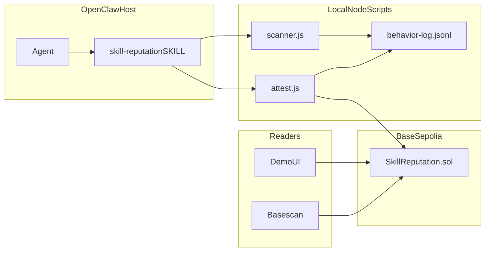

# SkillReputation

**SkillReputation** is an **OpenClaw skill extension** (think: a **plugin for your agent**) that adds three coordinated capabilities: (1) **discover and fingerprint** other skills on disk, (2) **append a local, inspectable behavior log**, and (3) **optionally anchor attestations on-chain** on Base Sepolia with a small **read-only dashboard** so humans can see what was attested.

This README is intentionally long. OpenClaw operators rarely get one place that explains *how a skill pack is supposed to fit into the runtime*, what is honest vs marketing, and which knobs are safe to turn. If you only want commands, jump to [On-chain and demo: Base Sepolia (quick path)](#on-chain-and-demo-base-sepolia-quick-path).

---

## Table of contents

1. [What “plugin” means here](#what-plugin-means-here)
2. [Problem statement](#problem-statement)
3. [How it plugs into OpenClaw](#how-it-plugs-into-openclaw)
4. [Repository map](#repository-map)
5. [End-to-end mental model](#end-to-end-mental-model)
6. [Installing the skill (operators)](#installing-the-skill-operators)
7. [Using the skill inside OpenClaw (agents)](#using-the-skill-inside-openclaw-agents)
8. [Behavior log, digest, and trust](#behavior-log-digest-and-trust)
9. [Identity: skillKey](#identity-skillkey)
10. [Environment variables (reference)](#environment-variables-reference)
11. [On-chain and demo: Base Sepolia (quick path)](#on-chain-and-demo-base-sepolia-quick-path)
12. [Live deployment (submission)](#live-deployment-submission)
13. [Ship to GitHub](#ship-to-github)
14. [gstack workflow (optional)](#gstack-workflow-optional)
15. [Limitations, FAQ, and post-hackathon ideas](#limitations-faq-and-post-hackathon-ideas)

---

## What “plugin” means here

OpenClaw’s primary extension surface for **teaching the model how to behave** is the **skill**: a directory with a `SKILL.md` manifest (YAML frontmatter + Markdown instructions) and optional scripts. The upstream docs and registry (ClawHub) call this a **skill**, not a “plugin.”

In **this repository**, we use **plugin** in the everyday sense: *a bundle you install to extend a host app.* Concretely, SkillReputation is:

- **A skill folder** under [`skill/`](skill/) (`SKILL.md` + `scripts/`) that OpenClaw can load like any other skill.
- **A tiny off-chain toolchain** (`scanner.js`, `attest.js`) the agent or human runs with Node.
- **An optional on-chain module** under [`contracts/`](contracts/) you deploy once per environment.
- **An optional demo UI** under [`demo-ui/`](demo-ui/) that reads public chain data.

Nothing here patches OpenClaw core. There is no `openclaw.plugin.json` host hook in this repo: you **install the skill** where OpenClaw already looks for skills, and the agent gains new instructions and CLI entrypoints.

---

## Problem statement

OpenClaw skills are powerful because they are **portable text + scripts**. That portability makes it hard to answer simple operational questions:

- **What skills are actually installed on this machine right now?**
- **Did the contents of a skill change since last week?** (file metadata + hash of `SKILL.md`)
- **Can we record a human or agent judgment** (“this skill behaved well / poorly for this demo”) **in a durable, shareable way?**

SkillReputation does **not** claim to cryptographically prove what the model did at runtime. OpenClaw does not expose a stable, documented “skill X was invoked at time T” webhook in this MVP. Instead, this pack focuses on **transparent inventory**, **explicit attestations**, and **clear separation** between *what we observed on disk* vs *what someone believes*.

---

## How it plugs into OpenClaw

OpenClaw discovers skills from several locations (precedence is roughly: project and workspace paths win over shared machine paths; see current OpenClaw docs for the exact order). Typical locations include:

- A project’s `skills/` or `.agents/skills/`
- `~/.openclaw/skills` for shared local skills
- `~/.agents/skills` for personal agent skills

**SkillReputation** adds a skill named `skill-reputation` (see [`skill/SKILL.md`](skill/SKILL.md)). When that skill is loaded:

- The **model** reads when to run the scanner, how to interpret the log, and when attestation is allowed (user-gated).
- The **runtime** (you, or the agent with shell access) runs `node` scripts declared in the skill.

The skill’s frontmatter declares `metadata.openclaw.requires` so OpenClaw can **gate** visibility on env vars and `node` being present. That is how this “plugin” declares its power cord.

---

## Repository map

| Path | Role |
|------|------|
| [`skill/`](skill/) | **OpenClaw skill**: `SKILL.md` + `scripts/` + `package.json`. This is the piece you “plug in” to OpenClaw. |
| [`contracts/`](contracts/) | **Solidity + Hardhat**: `SkillReputation.sol` — emits `Attested` events; optional trusted-only mode. |
| [`demo-ui/`](demo-ui/) | **Next.js 15** dashboard: read-only `getContractEvents` against your deployed contract. |
| [`package.json`](package.json) (repo root) | **npm workspaces** so you can run `npm test` once at the root. |

Root [`AGENTS.md`](AGENTS.md) documents gstack habits for humans using Claude Code behind OpenClaw.

---

## End-to-end mental model



1. **Scan** walks configured roots, finds `SKILL.md` files, parses minimal frontmatter, computes **`skillKey`**, builds a canonical JSON snapshot, hashes it into **`digest`**, and appends one JSON line to the log.
2. **Attest** reads the latest scan digest, resolves a target `skillKey`, and sends **`attest(skillKey, score, digest)`** from your attestor wallet.
3. **Demo UI** replays **`Attested`** logs for a wallet-optional, read-only view.

---

## Installing the skill (operators)

You only need the **`skill/`** directory on disk somewhere OpenClaw’s skill loader will see it. Three common patterns:

1. **Copy** `skill/` into `~/.openclaw/skills/skill-reputation/` (or any subdirectory under a configured skills root).
2. **Symlink** this repo’s `skill/` folder into a skills directory during development.
3. **Point `skills.load.extraDirs`** (OpenClaw config) at the absolute path of this repo’s `skill/` directory.

Then run `npm install` inside that `skill/` folder once so `viem` is available to the scripts.

---

## Using the skill inside OpenClaw (agents)

The canonical instructions live in [`skill/SKILL.md`](skill/SKILL.md). In short:

- **Scan** after installs or when the user asks for an inventory of local skills.
- **Attest only when the user explicitly requests** an on-chain score; never invent attestation intent.
- **Never put private keys in the skill markdown**; only env var names.

Scripts resolve paths using OpenClaw’s `{baseDir}` convention documented upstream.

---

## Behavior log, digest, and trust

The scanner appends **one JSON object per line** (JSONL). The important line type is `"type":"scan"`, which includes:

- **`digest`**: `keccak256` of the UTF-8 bytes of `JSON.stringify(snapshot)` for a stable snapshot object.
- **`snapshot`**: includes roots used, timestamp, and an array of discovered skills with paths, mtimes, and `skillKey`.

**Trust boundaries:**

- The log file is **local**. Anyone with filesystem access can edit it. The on-chain **`digest`** is a commitment to whatever snapshot was hashed at scan time, not a proof of OS integrity.
- **`score`** is an **opinion** of the attestor key, not a cryptographic proof of behavior.
- In **open mode** (`requireTrusted == false`), **any** wallet can emit attestations; treat that as a **demo / transparency** setting, not spam resistance.

---

## Identity: skillKey

Matches the hash computed in [`skill/scripts/lib/skillKey.js`](skill/scripts/lib/skillKey.js):

1. `normalizedName` = frontmatter `name` trimmed, lowercased, whitespace collapsed to single spaces.
2. `nameHash` = `keccak256(utf8(normalizedName))`.
3. `bodyHash` = `keccak256(utf8(file contents after strip BOM, CRLF→LF))`.
4. `skillKey` = `keccak256(abi.encodePacked(nameHash, bodyHash))` (two `bytes32` values, then hashed — same as viem `encodePacked` + `keccak256`).

This ties the on-chain identifier to **the actual `SKILL.md` bytes**, not merely a human-chosen slug.

---

## Environment variables (reference)

| Variable | Where | Purpose |
|----------|-------|---------|
| `BASE_SEPOLIA_RPC_URL` | `contracts/.env`, `skill/.env` | JSON-RPC endpoint for deploy / attest. |
| `PRIVATE_KEY` | `contracts/.env` | Deployer key for `hardhat run` (throwaway on testnet). |
| `REQUIRE_TRUSTED` | `contracts/.env` | Passed to deploy script; must match verify args. |
| `BASESCAN_API_KEY` | `contracts/.env` | Optional; enables `hardhat verify` against BaseScan’s API. |
| `SKILL_REPUTATION_CONTRACT` | `skill/.env` | Deployed `SkillReputation` address for `attest.js`. |
| `ATTESTOR_PRIVATE_KEY` | `skill/.env` | Hot wallet that sends attestations (minimal balance). |
| `SKILL_REPUTATION_ROOTS` | env | Semicolon-separated extra scan roots. |
| `SKILL_REPUTATION_LOG` | env | Override JSONL log path. |
| `NEXT_PUBLIC_BASE_SEPOLIA_RPC_URL` | `demo-ui/.env.local` | Public RPC for the browser (never put paid API secrets in `NEXT_PUBLIC_*`). |
| `NEXT_PUBLIC_SKILL_REPUTATION_CONTRACT` or `NEXT_PUBLIC_CONTRACT_ADDRESS` | `demo-ui/.env.local` | Contract address for the dashboard (aliases supported). |
| `NEXT_PUBLIC_FROM_BLOCK` | `demo-ui/.env.local` | Optional decimal block number; invalid values are ignored. |

---

## On-chain and demo: Base Sepolia (quick path)

This section is the **Sepolia deployment path** left intact for hackathon and demo use. It assumes a throwaway wallet and public or project RPC URLs.

### Prerequisites

- Node.js 20+
- A [Base Sepolia](https://www.base.org/build/base-sepolia) RPC URL and test ETH ([faucet](https://www.coinbase.com/faucets/base-ethereum-goerli-faucet) or [Alchemy](https://www.alchemy.com/faucets/base-sepolia)).

From the repo root [`skill-reputation/`](.) (the folder that contains `contracts/`, `skill/`, and `demo-ui/`).

### 1. Contracts

```bash
cd contracts
npm install
cp .env.example .env
# Edit .env: BASE_SEPOLIA_RPC_URL, PRIVATE_KEY (throwaway deployer), optional BASESCAN_API_KEY for verify
npx hardhat compile
npx hardhat run scripts/deploy.js --network baseSepolia
```

`REQUIRE_TRUSTED` in `.env` must match the boolean you pass to verify (default is open mode):

```bash
# If you deployed with REQUIRE_TRUSTED=false (default):
npx hardhat verify --network baseSepolia <DEPLOYED_ADDRESS> false
```

Copy the printed **contract address** into `skill/.env` and `demo-ui/.env.local` (see `.env.example` files).

### 2. Skill (OpenClaw)

Install the folder under a path OpenClaw loads, e.g. `~/.openclaw/skills/skill-reputation` (copy `skill/` contents) or add `skills.load.extraDirs` in OpenClaw config pointing at this repo’s `skill/` directory.

```bash
cd skill
npm install
cp .env.example .env
# SKILL_REPUTATION_CONTRACT, BASE_SEPOLIA_RPC_URL, ATTESTOR_PRIVATE_KEY (throwaway attestor)
npm run scan
npm run attest -- --skill skill-reputation --score 85
npm run attest -- --skill <some-other-skill> --score 72
npm run attest -- --skill <fake-suspicious-skill> --score 25
```

Use `--skill @/absolute/path/to/SKILL.md` if the skill was never picked up by the last scan.

### 3. Demo UI (local + Vercel)

```bash
cd demo-ui
npm install
cp .env.example .env.local
# NEXT_PUBLIC_BASE_SEPOLIA_RPC_URL — use a public RPC for production (never put API secrets in NEXT_PUBLIC_*)
# Contract: set NEXT_PUBLIC_SKILL_REPUTATION_CONTRACT and/or NEXT_PUBLIC_CONTRACT_ADDRESS to the same 0x address
npm run dev
```

Open [http://localhost:3000](http://localhost:3000).

**Deploy to Vercel** (after `.env.local` works locally):

```bash
npm install -g vercel
cd demo-ui
vercel
```

Set the same `NEXT_PUBLIC_*` variables in the Vercel project settings.

### Monorepo test shortcut

From the repo root:

```bash
npm install
npm test
```

Runs Hardhat tests in `contracts/` and `node:test` in `skill/` (workspaces).

---

## Live deployment (submission)

Replace placeholders after you deploy and record a demo.

| Item | Link |
|------|------|
| **Contract (Base Sepolia)** | [`0xYOUR_ADDRESS`](https://sepolia.basescan.org/address/0xYOUR_ADDRESS) |
| **Demo UI** | `https://your-app.vercel.app` |
| **Deploy tx** | [`0xYOUR_TX_HASH`](https://sepolia.basescan.org/tx/0xYOUR_TX_HASH) |
| **Demo video** | _Loom or YouTube — add after recording_ |

---

## Ship to GitHub

**Pre-flight:** ensure no real keys are staged.

```bash
# Unix / Git Bash
grep -r "PRIVATE_KEY" . --include="*.env" --include="*.env.local" 2>/dev/null
# Should only hit placeholder lines inside *.example files (or nothing).

git init
git add .
git status   # Eyeball: no .env, .env.local, artifacts/, node_modules/
git commit -m "Initial commit: SkillReputation for Encode April Agentic Mini Hack"
git remote add origin https://github.com/<your-username>/skill-reputation.git
git branch -M main
git push -u origin main
```

```powershell
# Windows PowerShell (spot-check for long hex private keys in tracked text)
git log -p 2>$null | Select-String -Pattern "PRIVATE_KEY|private_key=0x[a-f0-9]{64}" | Select-Object -First 5
# Should return nothing after a clean commit.
```

---

## gstack workflow (optional)

These steps run in **your** Claude Code or OpenClaw-backed session after [gstack](https://github.com/garrytan/gstack) is installed (`git clone … ~/.claude/skills/gstack && cd … && ./setup`). See also [`AGENTS.md`](AGENTS.md) for OpenClaw spawn hints.

| Step | Command | Purpose |
|------|---------|--------|
| Plan | **Load gstack. Run `/autoplan`** | CEO → design → eng style plan; save output, then implement. |
| Research | **Load gstack. Run `/browse`** | Web lookups (RPC docs, faucet, BaseScan) without improvised browser tooling. |
| Review | **Load gstack. Run `/review`** | Pre-ship bug and security pass on the diff. |

If you use OpenClaw to spawn Claude Code for coding, tell that session to load gstack and run `/autoplan` before large changes and `/review` before merge.

---

## Limitations, FAQ, and post-hackathon ideas

### Hard limitations (by design)

- **Scanner roots**: Set `SKILL_REPUTATION_ROOTS` (semicolon-separated paths). Defaults cover common OpenClaw / agent paths on Windows and Unix; skills outside those trees are invisible.
- **Trust**: On-chain scores are opinions of attestors, not cryptographic truth about behavior.
- **Trusted-only mode**: Deploy with `REQUIRE_TRUSTED=true` and use `setTrusted` for production-like gating; default deploy uses open attestation for hackathon demos.

### FAQ

**Why JSONL instead of SQLite?**  
So humans and agents can `tail` the file, copy lines into tickets, and reason about diffs without a binary format.

**Why is `digest` tied to the scan snapshot?**  
So third parties can see that an attestation referred to **a specific inventory state**, not a hand-waved story.

**Does the demo UI need a wallet?**  
No. It only uses a public RPC and a contract address.

**Can I run this without any chain?**  
Yes. The scanner and log are fully local. On-chain steps are optional.

### Post-hackathon (intentionally out of scope)

- Stronger YAML parsing for exotic `SKILL.md` frontmatters.
- Merkle roots over JSONL for tamper-evidence beyond a single-line digest.
- Optional indexer / subgraph instead of wallet-agnostic `getContractEvents` windows.
- OpenClaw-native telemetry if/when upstream exposes stable skill-invocation events.
