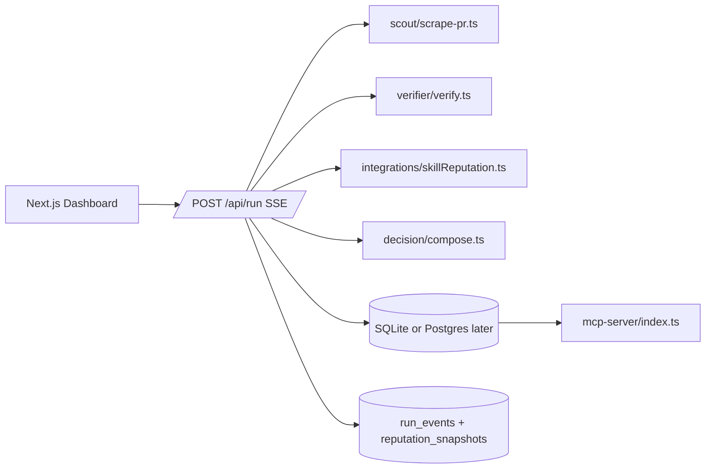

# Bounty Hunter AI Ops

One product for AI-driven bounty decisions. Submit a PR run, verify evidence in a real browser, score reputation, and output a finance-ready decision with confidence and reasons.

This runtime is intentionally AI-only: no on-chain payout execution and no wallet/contract dependency.

## Product architecture



## Stack in this workspace

- [`../bounty-hunter`](.) ù main runtime and UI.
- [`../skill-reputation`](../skill-reputation) ù optional scanner-backed reputation signal source.
- [`../gstack`](../gstack) ù optional developer workflow commands.

## Quickstart

```bash
npm install
npx playwright install chromium
cp .env.example .env.local
npm run dev
```

Open `http://localhost:3000`, create a run, and follow the streamed timeline.

### Env reference

```bash
DB_PATH=./bounty-hunter-ai.db
DECISION_AUTO_APPROVE_THRESHOLD=0.75
APP_API_TOKEN=

BH_ENABLE_SKILL_REPUTATION=0
SKILL_REPUTATION_SKILL_DIR=../skill-reputation/skill
```

- `APP_API_TOKEN` is optional. If set, requests must include `x-api-token` and role in `x-role`.
- `BH_ENABLE_SKILL_REPUTATION=1` enables scanner-backed reputation. If unavailable, runtime falls back to local heuristic scoring.

## Runtime flow

1. Insert run row (`pending`) in DB.
2. Scout fetches PR page, parses merged state/author, captures screenshot artifact.
3. Verifier evaluates deterministic rules.
4. Reputation module enriches with score/confidence/reasons.
5. Decision composer outputs one of:
   - `approved_for_payment`
   - `needs_manual_review`
   - `rejected`
6. Persist decision + events + reputation snapshot for audit.

## Decision statuses

- `pending`: run started.
- `approved_for_payment`: auto-approved and ready for finance operations.
- `needs_manual_review`: confidence below auto-approve threshold.
- `rejected`: verification did not pass.
- `run_failed`: technical failure in pipeline.

## Tests

```bash
npm run test:verifier
npm run test:decision
npm run test:scout
```

## MCP server

Run:

```bash
npm run mcp
```

Tools:
- `list_bounties(status?)`
- `get_bounty(id)`
- `get_skill_profile(githubUsername)`

Resources:
- `bounty://{id}`
- `profile://{githubUsername}`

## Deployment

Use the operational runbook in [`DEPLOYMENT.md`](DEPLOYMENT.md) for production setup, SLOs, and release checks.
